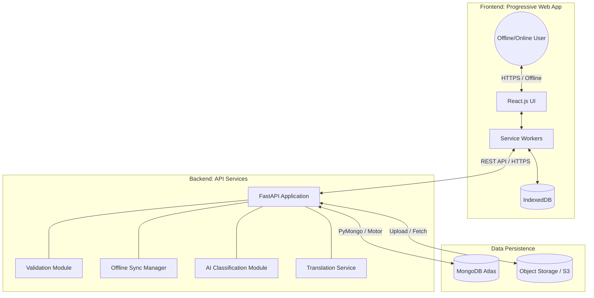

# ALERTO - System Architecture Document

## 1. Global Architecture Diagram

The ALERTO platform follows a decoupled, cloud-native architecture optimized for high availability, low cost, and offline resilience.

## 2. Component Descriptions

### 2.1 Frontend (Progressive Web App)
- **Technology:** React.js, Service Workers, IndexedDB, Leaflet/Mapbox for mapping.
- **Deployment:** Vercel (Free Tier).
- **Core Responsibilities:**
  - Provide a responsive, app-like experience in the browser.
  - Form capture (images, dynamic questions, geolocation via GPS or map selection).
  - Interactive map visualization of reported damages.
  - Manage offline state and queue requests locally using IndexedDB and Service Workers.
  - Real-time language switching and localized UI representation.

### 2.2 Backend (API Layer)
- **Technology:** FastAPI (Python), Docker.
- **Deployment:** Render (Free Tier).
- **Core Responsibilities:**
  - Serve as the central communication hub processing RESTful requests.
  - Implement business logic, validation, and data cleaning.
  - **Offline Sync:** Expose a dedicated `/sync-offline` endpoint to handle bulk queued requests from PWA clients.
  - **AI Integration:** Orchestrate AI services for automatic damage classification from images to accelerate data entry.
  - **Translation:** Coordinate automatic translation of textual descriptions into standard formats.
  - Export generation (GeoJSON, CSV).

### 2.3 Database
- **Technology:** MongoDB Atlas (NoSQL).
- **Deployment:** Managed Cloud (Free Tier).
- **Core Responsibilities:**
  - Store unstructured and highly varied JSON documents (reports, analytics).
  - Advanced geospatial querying utilizing `2dsphere` indexes on GeoJSON data to detect duplicates, cluster damage, and map critical zones.
  - Maintain historical versions of reports for auditability.

### 2.4 Storage
- **Technology:** Cloud Object Storage (e.g., local storage mimicking S3, or AWS S3 free tier interface).
- **Core Responsibilities:**
  - Securely store media blobs (captured/imported field photos).
  - Provide compressed and optimized image delivery to the frontend to reduce bandwidth in crisis zones.

---

## 3. Data Flow

**From User Input to Storage and Dashboard:**

1. **Capture:** The user fills out a report (photo, location, description, damage level). 
2. **Local Processing:** If offline, the PWA intercepts the request via the Service Worker, saves the payload and image Blob in IndexedDB, and queues it.
3. **Transmission:** When connectivity is established (or immediately if online), the PWA sends a POST request with the data to the FastAPI backend.
4. **Validation & Augmentation:**
   - FastAPI receives the payload.
   - The Validation module ensures mandatory fields exist and sanitizes inputs.
   - The AI module analyzes the image to verify or suggest the `damage_level`.
   - The Translation module normalizes description strings.
5. **Deduplication:** A backend geospatial query checks MongoDB for existing reports within a tight radius (e.g., 50m) and time window.
6. **Storage:**
   - The image is saved to the Object Storage, yielding an `image_url`.
   - The structured JSON document (including `image_url` and GeoJSON location) is saved to MongoDB in the `reports` collection.
7. **Visualization:** The Dashboard/Map components fetch updated records via `GET /reports`, rendering color-coded map markers and aggregated analytics.

---

## 4. Offline Synchronization Mechanism

The system ensures zero data loss during network outages common in crisis areas.

1. **Local Queueing:** When the network is unreachable, form submissions are intercepted by the Service Worker and stored locally in **IndexedDB** in a dedicated `sync_queue` object store.
2. **Background Sync:** The Service Worker utilizes the Background Sync API (where supported) or intercepts network reconnect events.
3. **Sync Execution:** 
   - The PWA initiates a POST to `/sync-offline` with a batch array of stored reports.
   - These payloads carry a `{"source": "offline"}` flag.
4. **Conflict Resolution & Versioning:** If a report was modified locally while offline, the backend leverages the `reports_versions` collection to safely append the new state without destroying previous data.
5. **Queue Cleanup:** Upon receiving a `200 OK` response from the backend, the PWA removes the processed items from IndexedDB.

---

## 5. API Structure Overview

A RESTful approach using FastAPI, ensuring clear, typed, and well-documented endpoints (auto-generated via Swagger/OpenAPI).

**Core Endpoints:**
- `POST /reports` : Submit a new damage report (multipart form for image + JSON).
- `GET /reports` : Retrieve reports (supports query params: `?bbox=...` for map bounds, `?crisis_type=...`).
- `GET /reports/{id}` : Fetch specific report details.
- `POST /sync-offline` : Batch ingest offline-queued reports.
- `GET /export` : Export data (supports query params: `?format=csv|geojson`).
- `GET /analytics/hotspots` : Retrieve pre-calculated dense crisis zones based on spatial clustering.

---

## 6. Scalability Considerations

While utilizing free tier services for the MVP, the architecture is inherently designed to scale horizontally:
- **Frontend:** Vercel automatically deploys the static HTML/JS/CSS assets to a global CDN. It handles infinite traffic spikes gracefully.
- **Backend:** FastAPI runs asynchronously via Uvicorn. Containerized via Docker, it can transition easily from Render's free tier to a managed Kubernetes cluster or auto-scaling container service if load increases.
- **Database:** MongoDB naturally supports **Sharding** (distributing data across multiple machines). The schema is denormalized correctly to avoid complex JOINs, keeping read/write operations extremely fast even with 500,000+ reports.
- **Payload Optimization:** Compressing images client-side before upload saves bandwidth and storage. Enabling pagination and caching (future Redis integration) on `GET /reports` prevents database strain.

---

## 7. Security Considerations

Protecting user identities and system integrity post-disaster is critical.

- **Data in Transit:** Full end-to-end encryption using TLS/HTTPS mandatory on Vercel and Render.
- **Anonymization:** User sessions do not require PII (Personally Identifiable Information) beyond geolocation and what is voluntarily provided in descriptions. Identifiers are abstracted.
- **Rate Limiting:** FastAPI will implement rate-limiting middleware (e.g., max 10 reports per minute per IP) to prevent DDoS attacks or malicious bot spamming.
- **Validation:** Strict backend Pydantic models will drop extraneous payload parameters to prevent NoSQL injection.
- **Endpoint Protection:** Export APIs and authorities' dashboards can be protected via JWT authentication or API keys.
